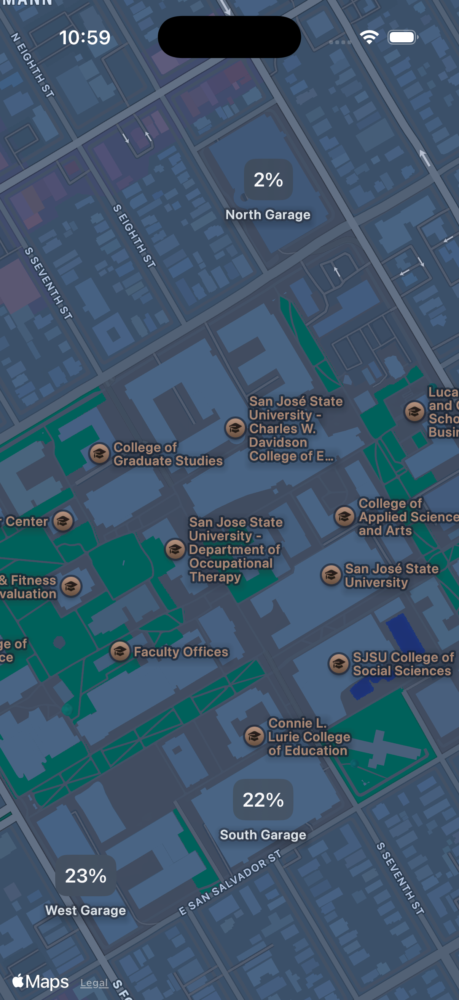

# SJSU Parking App

Swift app that displays real-time capacity for San Jose State University parking garages. The app shows each main campus garage's current capacity and provides a visual map view.

## Requirements

- macOS with Xcode installed
- Xcode 12 or later

## Run

1. Open the project in Xcode: [SJSU Parking.xcodeproj](SJSU%20Parking.xcodeproj)
2. Select a simulator or connected device and press Run.

## Screenshot
